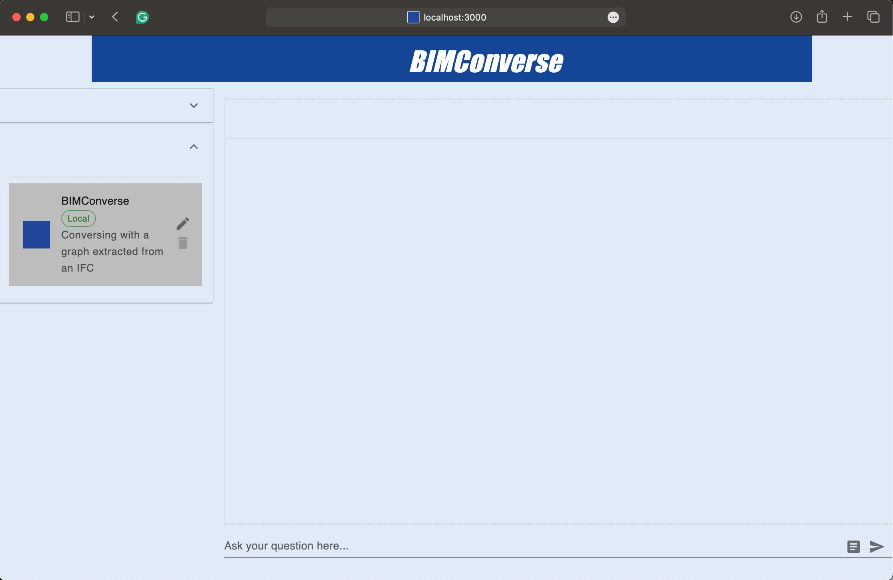

# BIMConverse

**Unlocking BIM data for everyone — ask a building anything, in plain English.**



BIMConverse is a chat interface that lets anyone query Building Information Modelling (BIM)
data without knowing a query language. Behind the chat, a BIM archive lives in a Neo4j
labelled property graph; an LLM translates each question into Cypher, runs it against the
graph and translates the JSON result back into natural language.

> Natural Language Question → LLM → Cypher Query → Neo4j
> Neo4j → JSON → LLM → Natural Language Answer

This repository is an adaptation of [NeoConverse](https://github.com/neo4j-labs/neoconverse)
by Neo4j Labs. We kept the app's architecture — Next.js front end, Neo4j JavaScript driver,
prompt middleware — and reworked it into a BIM-specific tool: rebranded UI, prompt and
post-processing changes for building queries, and a graph agent configured against an
IFC-derived graph.

The work is documented in *BIMConverse: Unlocking BIM Data for Everyone*, Chapter 16, by
Libny Pacheco and Christoph Berkmiller.

---

## Why

BIM adoption is high, but the data stays locked behind specialised tools and query
languages. Questions that architects actually ask —

- *Which rooms have water-resistant materials facing them?*
- *Every fire-rated door placed in a wall that itself lacks a fire rating.*
- *All kitchens adjacent to living spaces with natural light.*

— are trivial to phrase and hard to execute. Following Ackoff's knowledge pyramid, a BIM
file on its own gives you **data** (a wall's thickness, a room's area). Putting it in a
graph gives you **information** (this door has a 60-minute rating and opens onto a
corridor). Traversing that graph gives you **knowledge** (the typical build-up of a wall
between a bedroom and a kitchen, across 60 projects).

Relational and document databases describe *what things are*. A graph describes *how things
connect* — which is what building questions are usually about.

---

## How it works

The full workflow has two stages. **This repository is stage 2.**

**Stage 1 — Graph building (external Python pipeline).** Revit models are exported to IFC
with second-level space boundaries (`IfcRelSpaceBoundary`) and all property sets enabled.
A Python pipeline then converts each IFC file into a graph and loads it into Neo4j:

- **[IfcOpenShell](https://ifcopenshell.org/)** parses the IFC and extracts explicit data —
  elements, attributes, and relationships such as `ContainedIn`
  (`IfcRelContainedInSpatialStructure`) and `HostedBy` (`IfcRelFillsElement`).
- **[TopologicPy](https://topologicpy.readthedocs.io/)** derives what IFC does *not* state:
  wall-to-wall adjacency (shared boundary faces) and direct room adjacency (rooms separated
  only by a logical line, as in open-plan spaces).
- **Custom algorithms** reconstruct each wall layer's 3D solid from its 2D profile and map
  it one-to-one onto the ordered material list, so queries can reach the physical
  composition of a wall and which layer faces which room.

**Stage 2 — Graph querying (this repository).** A single-page Next.js app connects the user,
an LLM and the Neo4j database:

1. The user types a question in the chat.
2. `CYPHER_GENERATION_PROMPT` combines the question with the graph schema, the few-shot
   examples and the conversation history, and sends it to the LLM (GPT-4o by default).
3. The LLM returns a Cypher query; `cypherCleanup` strips prefixes, markdown fences and
   `LIMIT` clauses before execution.
4. Neo4j runs the query and returns JSON.
5. `HUMAN_READABLE_MESSAGE_PROMPT` sends that JSON back to the LLM with formatting
   instructions, and the natural-language answer is rendered in the chat.

Because the answer is always derived from a database query rather than generated from the
model's own knowledge, the system does not fabricate building data. It either answers from
the graph or says it cannot.

---

## The graph model

Nodes carry the attributes extracted from IFC; edges carry both the explicit IFC
relationships and the ones derived topologically.

| Node label | Selected attributes |
|---|---|
| `Room` | GlobalId, Name, Project, Level, Height, GrossFloorArea, GrossNetArea, GrossVolume |
| `Wall` | GlobalId, Name, Project, Level, IsExternal, LoadBearing, Height, Length, Width, Type Mark |
| `Door` | GlobalId, Name, Project, Level, IsExternal, Rough Height/Width, Material Panel, Material Frame, OperationType, Construction Type, Function |
| `Window` | GlobalId, Name, Project, Level, IsExternal, Rough Height/Width, SillHeight, Material Exterior/Interior, Panel Operation, Type Mark |
| `Furniture` | OID, Name, Project, Level |
| `Material` | OID, Material Name, Project, Function |

| Relationship | Meaning | Source |
|---|---|---|
| `ContainedIn` | Wall / Door / Window / Furniture → Room | explicit (IFC) |
| `HostedBy` | Door / Window → Wall | explicit (IFC) |
| `Access` | Room → Room, with `AccessType`: Direct, Door, Window, Stair | explicit + derived |
| `IsConnected` | Wall → Wall physical adjacency | derived (TopologicPy) |
| `ConsistsOf` | Wall → its material layers | custom algorithm |
| `IsFacing` | Layer → Room it faces | custom algorithm |
| `InternallyConnected` | Layer → Layer within a wall | custom algorithm |

Graph integrity is enforced with uniqueness constraints on `GlobalId`, relationship
validation and test runs on each import.

---

## Getting started

### Prerequisites

- **Node.js** and npm
- **[Neo4j Desktop](https://neo4j.com/download/)** (or any reachable Neo4j instance) with
  your IFC-derived graph loaded
- An **LLM API key** — OpenAI (GPT-4o) is what we used; Google Vertex Gemini and AWS
  Bedrock Claude are also supported by the underlying app

### Install and run

```bash
git clone https://github.com/libnypacheco/bimconverse.git
cd bimconverse
npm install --legacy-peer-deps
```

Development server (the mode used throughout the research, with hot reload):

```bash
npm run dev
```

Production build:

```bash
npm run build
npm run start
```

The app runs at <http://localhost:3000>.

### Environment variables

No `.env` file is needed if you only use **local agents** — agents you create in the UI,
whose credentials and connection details are stored in your browser. Set the variables below
only if you want *predefined* agents served from a backend Neo4j database (see the sample
scripts in `agents/cypherScripts/`).

```
OPENAI_API_KEY=<OpenAI key>
GOOGLE_API_KEY=<Google API key, for GCP users>
AWS_ACCESS_KEY_ID=<AWS credentials, for Bedrock users>
AWS_SECRET_ACCESS_KEY=<AWS credentials, for Bedrock users>
AWS_MODEL=claude-3-haiku-20240307
GOOGLE_MODEL=gemini-1.0-pro
OPENAI_MODEL=gpt-4
DEFUALT_PROVIDER="Open AI"
DEFUALT_MODEL="gpt-4-turbo-preview"
ENCRYPTION_KEY=neoconversesecretkey
NEXT_PUBLIC_BACKEND_HOST =
NEXT_PUBLIC_BACKEND_UNAME =
NEXT_PUBLIC_BACKEND_PWD =
NEXT_PUBLIC_BACKEND_DATABASE =
```

### Configuring the BIMConverse agent

Add an agent in the UI and fill in the five tabs. This is a one-time setup, saved for future
sessions:

1. **General** — agent name and description.
2. **Neo4j Connection** — protocol, hostname, port, database, username, password of your
   local Neo4j instance.
3. **Gen AI API** — provider, API key and model (e.g. OpenAI / `gpt-4o`).
4. **Schema** — the blueprint of your graph: node properties, relationship properties and
   the relationships between nodes. This is the "world knowledge" the LLM needs to write
   valid Cypher, so it is the single highest-leverage field in the setup.
5. **Few shot examples** — sample question/Cypher pairs that steer the shape of the answers
   you want back.

---

## Example questions

Data queries — counts and attributes:

- *How many walls are in the database?*
- *Group the amount of walls by projects.*
- *How many walls in Project 0301 are marked as external?*
- *From those 50 walls, name the unique wall types and add their material.*

Information queries — filtered, contextualised, relational:

- *List all rooms in Project 2602 that are larger than 20 square meters.*
- *How many wall layers are facing the room with GlobalId = …? Could they be considered
  water repellent by their name?*

Knowledge queries — patterns and multi-hop spatial reasoning:

- *What materials should be in a wall between a bedroom and a kitchen?* (synthesises a
  typical build-up across every wall that matches the condition)
- *How many rooms in Project Hus28 do not have a window but are directly connected to a room
  with a window? Count each room only once.*

The chat keeps conversational context, so these can be asked as a drill-down: start broad,
then group, filter and detail. A button reveals the generated Cypher, so results can be
cross-checked even without knowing the language.

---

## What we changed from NeoConverse

| Area | Change |
|---|---|
| Branding & UI | BIMConverse title and header, blue/white palette, decorative Neo4j shapes and logo removed, single-agent layout, custom favicon |
| Prompt (`lib/prompt.ts`) | Instruction added not to include a `LIMIT` clause, so counts and lists are not silently truncated |
| Post-processing (`lib/middleware.ts`) | `cypherCleanup` strips any surviving `LIMIT n` clause alongside the existing prefix and markdown-fence cleanup |
| Debugging (`lib/middleware.ts`) | The assembled prompt is logged to the terminal, making prompt iteration visible during development |
| Agent list & chat | Predefined-agent section collapsed, headings hidden and contrast raised for the BIM use case |

---

## Case study

The system was developed against an archive of **60 BIM projects from White Arkitekter**
(2016–2022) — residential work, from small multi-family houses to large complexes, all past
the Swedish planning application stage (*bygglöv*).

Conversion time scales with project size: a five-family residential building processed in
under two minutes; an 80-apartment complex took up to 50 minutes per floor, several hours in
total. The dominant difficulty was not geometry but heterogeneity — inconsistent parameter
naming across a multi-year archive, especially in window and door families, which required
iterative mapping work.

---

## Limitations

- **Prompt clarity matters.** The system does not hallucinate, but an ambiguous question
  produces a query that is data-consistent yet not what you meant. *"Largest window"* (area?
  width? height?) failed where *"highest window"* succeeded.
- **Context can slip.** Conversation history is kept, but the model occasionally drops a
  previously established scope — *"this project"* may be read as the whole database. Naming
  the project in each question avoids it.
- **Scope of the graph bounds the questions.** Depth of knowledge queries is limited by which
  components, categories and attributes were transferred into the graph.
- **Pathfinding is purely topological.** Routes may pass through private apartments, because
  the graph does not yet encode public/private semantics.

---

## Roadmap

**Graph**

- **Federation** — link the architectural model to MEP/structural systems, cost and
  sustainability databases, and IoT sensor data, enabling queries like *"total embodied
  carbon for all external walls in Project X"*.
- **Depth and scale** — vertical connectivity for multi-storey elements (cores, façades),
  and spatial pre-filtering (e.g. octrees) to tame N-to-N adjacency computation.
- **Semantics** — public vs private space, fire ratings and similar constraints, to support
  real compliance analysis (*"all wheelchair-accessible spaces connected by a step-free path
  with 90 cm minimum door widths"*).

**Interface**

- Multiple collaborating agents instead of a single agent handling the whole query.
- Ambiguity detection with clarifying questions.
- A dedicated field for project scope, to stop context slipping between questions.
- Visual feedback: every element carries its `GlobalId`, so results can be highlighted in a
  3D viewer — the open question is how to show results spanning several distinct projects.

---

## Technology stack

- **Front end**: Next.js / React with Tailwind CSS forms and MUI
- **Language**: TypeScript
- **Database**: Neo4j, queried through the Neo4j JavaScript driver
- **LLM**: OpenAI GPT-4o (Google Vertex Gemini and AWS Bedrock Claude also supported)
- **Charts**: ECharts for React
- **Graph building (separate pipeline)**: Python, IfcOpenShell, TopologicPy

---

## Credits

BIMConverse was developed by **Libny Pacheco** and **Christoph Berkmiller** as part of
IAAC's MaCAD programme, and is documented in *BIMConverse: Unlocking BIM Data for Everyone*
(Chapter 16).

Thanks to German Otto Bodenbender, David Leon, Laura Ruggeri, Bao Trinh, João Silva and
Professor Wasim Jabi (TopologicPy). Thanks to White Arkitekter — Peter Lechouvious, Adalaura
Diaz, Martin Johnson, John Nordman and Zebastian Olsson — for access to the Revit archive.

Built on [NeoConverse](https://github.com/neo4j-labs/neoconverse) by Neo4j Labs.

### Key references

- Ackoff, R.L. (1989). From data to wisdom. *Journal of Applied Systems Analysis*, 16, 3–9.
- Zhu, J., Wu, P., & Lei, X. (2023). IFC-graph for facilitating building information access
  and query. *Automation in Construction*, 148, 104778.
- Massafra, A., Jabi, W., & Gulli, R. (2024). Topological BIM for building performance
  management. *Automation in Construction*, 166, 105628.
- Khalili, A., & Chua, D.K.H. (2015). IFC-based graph data model for topological queries on
  building elements. *Journal of Computing in Civil Engineering*, 29, 04014046.

---

## License

MIT, as inherited from NeoConverse. You are free to use, modify and distribute this
software under the terms of the license.
